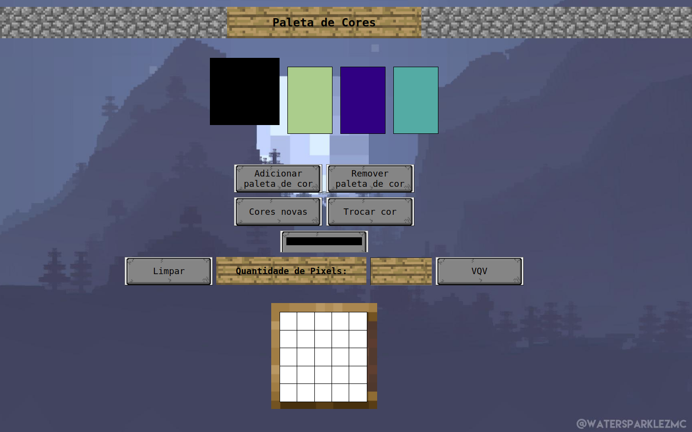

# Pixel Art

## Sobre o projeto:

O projeto é um site de desenho, com algumas paletas de cores aleatórias que são geradas, podendo adicionar, remover ou alterar a cor das paletas conforme desejar, o quadro inicial é de 5 por 5, podendo chegar até 50 por 50 para fazer desenhos em pixel art da maneira que preferir.

## Demonstração

## Tecnologias usadas:

Front-end:

>Desenvolvido usando: HTML5, CSS3, JavaScript;

## Instalando

Coloque a pasta pixel-art no local desejado.

## Executando aplicação

Para rodar o site, somente é preciso abrir o arquivo `index.html` em seu navegador e aproveitar o/
